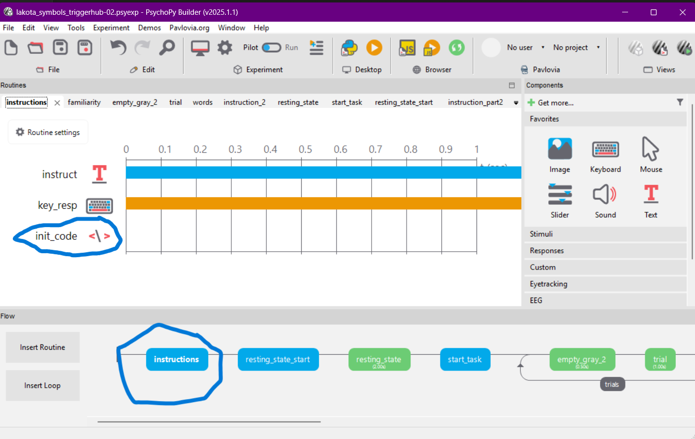
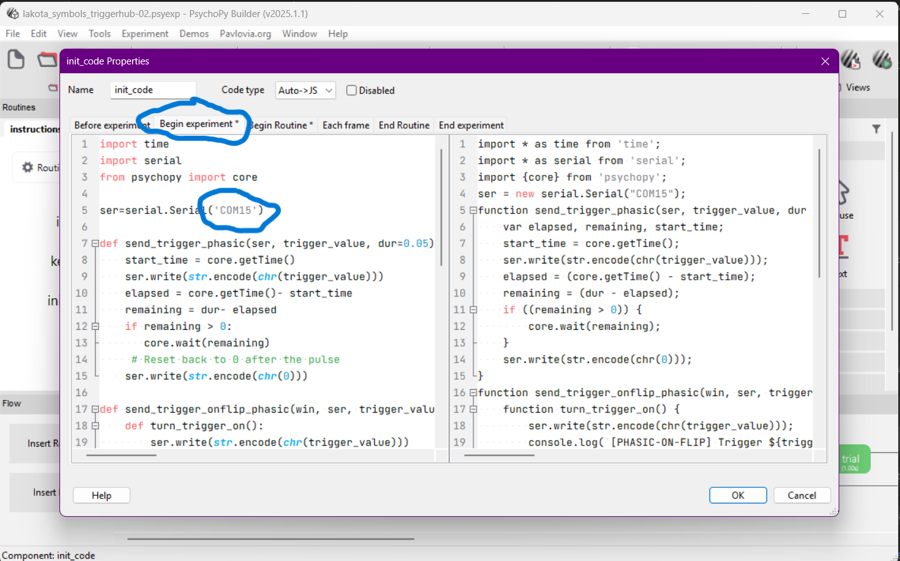
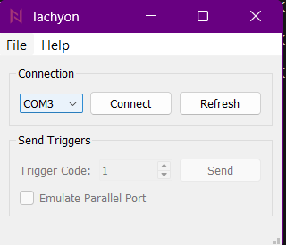

# Lakota Symbols Experiment — Setup Guide

Run the experiment (`lakota_symbols_triggerhub-02.psyexp`) in **PsychoPy Builder**
with the **DSI-24** EEG headset and the **Trigger-Hub (MMBT)** marker box.

Two roles are involved:

- **Stimulation computer** — runs PsychoPy; the **MMBT** is plugged into it.
- **Recording computer** — runs DSI-Streamer; the **DSI Bluetooth dongle** is plugged into it.

These can be **two computers or one**. On a single computer the same machine plays
both roles — just do every step on it.

Triggers travel **wirelessly** from the MMBT to a small **receiver dongle plugged
into the DSI-24**, which writes the marker straight into the EEG. The computers
never need to be networked — the marker is recorded inside the EEG itself.

---

## 1. What you need

| Item | Where it goes | Notes |
|------|---------------|-------|
| DSI-24 headset | — | WearableSensing dry EEG |
| Trigger receiver dongle | in the **DSI-24** | receives triggers wirelessly from the MMBT |
| DSI Bluetooth dongle | **recording PC** (USB) | the DSI-24 streams EEG to it; **replaces** the PC's built-in Bluetooth |
| MMBT (Trigger-Hub) box | **stimulation PC** (USB) | shows up as **"Arduino Micro"** |
| PsychoPy (Builder) | stimulation PC | runs the experiment |
| DSI-Streamer | recording PC | records the EEG — `DSI-streamer-and-drivers/DSI-Streamer-v.1.08.125_Released/DSI-Streamer-v.1.08.125.exe` |
| Tachyon | stimulation PC | quick trigger test — installer at `DSI-streamer-and-drivers/mmbt/TachyonSetup.exe` |

MMBT drivers and guides are in `mmbt/`.

---

## 2. One-time setup

**Stimulation computer**

1. Install **PsychoPy** (Standalone, 2025.1.x) — <https://www.psychopy.org/download.html>. `pyserial` is bundled, nothing else to install.
2. Plug in the MMBT and install its driver from `mmbt/MMBT drivers/`: run `dpinst-amd64.exe` (or `dpinst-x86.exe` on 32-bit). It then appears as **Arduino Micro** under Device Manager → **Ports (COM & LPT)** — note its COM number.
3. **Set the COM port in the experiment** (in Builder):

    Open `lakota_symbols_triggerhub-02.psyexp` in **PsychoPy Builder**, and in the **instructions** routine click the **`init_code`** component:

    

    Then open the **Begin Experiment** tab and set your COM number in the line `ser = serial.Serial('COM15')`:

    

    Save. *Tip:* pin the COM number in Device Manager → port **Properties → Port Settings → Advanced → COM Port Number** so it doesn't drift.

4. Install **Tachyon** (`DSI-streamer-and-drivers/mmbt/TachyonSetup.exe`) for the trigger test.

**Recording computer**

5. Plug in the **DSI Bluetooth dongle**. It acts as the computer's Bluetooth for the DSI — use it, **not** the PC's built-in Bluetooth.
6. Power on the DSI-24 and **pair** it with the dongle (Windows **Bluetooth settings → Add device →** select the DSI).

---

## 3. Steps to run the experiment

**Connect the hardware**

1. **Stimulation PC:** plug in the **MMBT** (USB).
2. **DSI-24:** plug the **trigger receiver dongle** into it.
3. **Recording PC:** make sure the **DSI Bluetooth dongle** is plugged in.
4. Power on the **DSI-24** and the **MMBT**.

**Start the EEG (recording PC)**

5. Open **DSI-Streamer** (`DSI-streamer-and-drivers/DSI-Streamer-v.1.08.125_Released/DSI-Streamer-v.1.08.125.exe`), pick the DSI's **outgoing** COM port, and press **Connect**.

    Pairing the DSI creates **two** Bluetooth COM ports for it — an *incoming* and an *outgoing* one. Use the **outgoing** port (the COMxx identified as the DSI's *out* port), **not** the incoming one. Find it in **Device Manager → Ports (COM & LPT)**, or under Windows **Bluetooth → More Bluetooth options → COM Ports** (the entry with **Direction = Outgoing**), then select that COMxx in DSI-Streamer.

6. Fit the headset and check impedances (**< 50 kΩ**).

**Test the triggers — with Tachyon, *before* recording**

7. On the stimulation PC, open **Tachyon** → select the MMBT COM port (the **Arduino Micro** port) → **Connect** → set a **Trigger Code** (e.g. `1`) → **Send**:

    

8. Watch DSI-Streamer: the trigger/event channel should jump to that value. If it stays at `0`, re-check steps 1–2 and the COM port.
9. **Close Tachyon** — it holds the COM port open, and PsychoPy can't use the MMBT until it's released.

**Record and run**

10. In DSI-Streamer, start **recording**.
11. On the stimulation PC, open `lakota_symbols_triggerhub-02.psyexp` in **PsychoPy Builder** and click **Run** (the green running-figure ▶). Enter participant / session.
12. Run the task — the MMBT marks each phase in the EEG as you go.
13. When finished, **stop recording** in DSI-Streamer.

---

## 4. Checklist

- [ ] MMBT driver installed; **Arduino Micro** shows a COM port
- [ ] COM port set in Builder (`init_code` → Begin Experiment → `serial.Serial('COMxx')`)
- [ ] Trigger receiver dongle in the DSI-24
- [ ] DSI Bluetooth dongle on the recording PC; DSI-24 powered on & paired
- [ ] DSI-Streamer **Connect**, impedances OK
- [ ] Tachyon test → trigger shows on the event channel → **Tachyon closed**
- [ ] DSI-Streamer **recording** started
- [ ] PsychoPy Builder **Run** → participant entered

---

## 5. Troubleshoot

| Symptom | Fix |
|---------|-----|
| `could not open port 'COMxx'` | COM port wrong or in use — **close Tachyon** (or any app holding it), check Device Manager, fix it in Builder. |
| MMBT not listed as Arduino Micro | Driver not installed — run `dpinst-amd64.exe` in `mmbt/MMBT drivers/`. |
| No triggers on the event channel | MMBT on USB & powered, **trigger receiver dongle** seated in the DSI-24, correct COM port. Confirm with Tachyon. |
| DSI won't connect | Use the **DSI Bluetooth dongle** (not built-in BT, not the trigger dongle); headset charged/on & paired; then **Connect** in DSI-Streamer. |
| COM number keeps changing | Pin it in Device Manager → Port Settings → Advanced → COM Port Number. |

---

For the experiment flow and the full trigger-code list, see the **[README](../readme.md)**.
